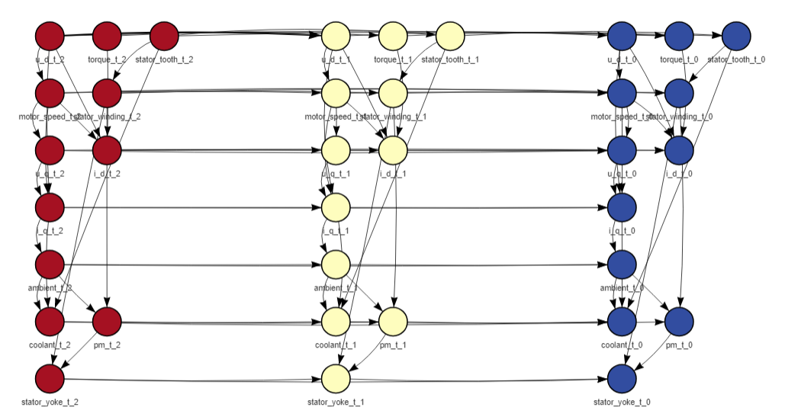

# dbnR

An implementation of Gaussian dynamic Bayesian networks (GDBN) structure learning and inference based on Marco Scutari's package bnlearn (http://www.bnlearn.com/). The structure learning algorithm implemented is a variation on Ghada Trabelsi's dynamic max-min hill climbing (https://tel.archives-ouvertes.fr/tel-00996061/document). The inference is performed either via the particle filtering offered by bnlearn or by doing exact inference over the multivariate Gaussian equivalent of a net implemented in this package. A visualization tool is implemented for GDBNs and bnlearn's BNs via the visNetwork package (https://github.com/datastorm-open/visNetwork).

## Current development news

As of today (18/12/2019), the main functionality of the package is running and working. The main two focus now are:
 * To tidy up the package with the idea of submitting it to CRAN
 * To add the possibility of learning nets with only certain previous lags instead of all of them. For example, a dbn with only the time slices for t_0 and t_12, or one with t_0, t_3 and t_4.

For now, the dbn.fit object as an extension of bnlearn's bn.fit object will stay the same except for the "mu" and "sigma" attributes added to it. This way, it remains easy to call bnlearn's methods on the dbn.fit object and I can store the MVN transformation inside the same object. Not an elegant solution, but its simplicity is enough.

## Getting Started

### Prerequisites

This package requires R ≥ 3.6.1 to work properly. It's possible to make it work for older versions of R and of each of the packages by fiddling with the [DESCRIPTION](DESCRIPTION) file, although this is not recommended.

The __bnlearn__ and __data.table__ packages, among others, are required for this package to work. They will be installed automatically when installing this package. They can also be installed manually via CRAN with the command

```
install.packages(c("bnlearn", "data.table"))
```
The packages __visNetwork__, __magrittr__ and __grDevices__ are optional for the visualization tool. They will only be required if you want to use it.

### Installing
As of today, the easiest way of installing dbnR is via the _install_github_ function in the __devtools__ package. The command you need to run is
```
devtools::install_github("dkesada/dbnR")
```
This will install the required dependencies if they are not available. After this, you will be ready to use the package.

## Basic examples

To get the structure of a GDBN from a dataset, you need to use the function _learn_dbn_struc_

```
library(dbnR)
data(motor)

size = 3
dt_train <- motor[200:2500]
dt_val <- motor[2501:3000]
net <- learn_dbn_struc(dt_train, size)
```
The dt argument has to be either a data.frame or a data.table of numeric columns, in the example we use the sample dataset included in the package. The size argument determines the number of time slices that your net is gona have, that is, the Markovian order of the net. A Markovian order of 2 means that your data in the present is independent of the past given the previous time slice. If your case doesn't meet this criteria, the size of the net can be increased, to take into account more past time slices in the inference. In our function, Markovian order = size - 1. The function returns a list with the learned structure and the folded dataset with the extended rows.

Once the structure is learnt, it can be ploted and used to learn the parameters
```
plot_dynamic_network(net)
```


```
f_dt_train <- fold_dt(dt_train, size)
fit <- fit_dbn_params(net, f_dt_train, method = "mle")
```
After learning the net, two different types of inference can be performed: point-wise inference over a dataset and forecasting to some horizon. Point-wise inference uses the folded dt to try and predict the objective variables in each row. Forecasting to some horizon, on the other hand, tries to predict the behaviour in the future M instants given some initial evidence of the variables.

## License

This project is licensed under the GPL-3 License, following on bnlearn's GPL(≥ 2) license - see the [LICENSE](LICENSE) file for details

## References

* The bnlearn package (http://www.bnlearn.com/).
* The visNetwork package (https://datastorm-open.github.io/visNetwork/)
* Kaggle's dataset repository, where the sample dataset is from (https://www.kaggle.com/wkirgsn/electric-motor-temperature)
